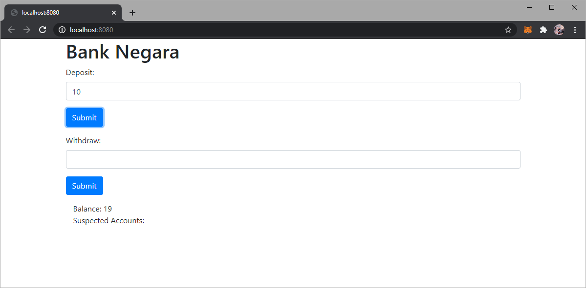

[![Forks][forks-shield]][forks-url]
[![Stargazers][stars-shield]][stars-url]
[![Issues][issues-shield]][issues-url]
[![MIT License][license-shield]][license-url]

<!-- ABOUT THE PROJECT -->

## About The Project

A simple **DApp** _(decentralized application)_ with web user interface so that a typical user can easily interact with it. For now, this **_basic_** DApp takes an amount of deposit/withdraw and update its balance **without** using ethereum wallet ! (WOWWW !! this is too basic and simple !)

### Built With

- [Solidity](https://docs.soliditylang.org/en/v0.8.0/) - an object-oriented, high-level language for implementing smart contracts.
- [Remix IDE](https://www.mysql.com/) - a browser-based compiler and IDE that enables users to build Ethereum contracts with Solidity language and to debug transactions.
- [Truffle](https://www.trufflesuite.com/truffle) - a development environment, testing framework and asset pipeline for Ethereum.
- [Ganache](https://www.trufflesuite.com/ganache) - personal blockchain for Ethereum development.
- [MetaMask](https://metamask.io/) - A crypto wallet & gateway to blockchain apps.

<!-- CONTRIBUTION -->

## Contribution

|   Name    |                Part/Contribution                |
| :-------: | :---------------------------------------------: |
| Amiruddin | Develop the front-end of the web user interface |
|  Danial   |            Perform the unit testing             |

<!-- USAGE EXAMPLES -->

## Getting Started

To get a local copy up and running follow these simple steps.

### Prerequisites

This is an example of how to list things you need to use the software and how to install them.

- npm
  ```sh
  $ npm install npm@latest -g
  ```
- truffle
  ```sh
  $ npm install -g truffle
  ```

### Installation

1. Clone the repo
   ```sh
   $ git clone https://github.com/amrnumenor/Regulation-Smart-Contract.git
   ```
2. Switch branch
   ```sh
   $ git checkout simple-regulator
   ```
3. Pull updates
   ```
   $ git pull
   ```
4. Install NPM packages
   ```sh
   $ npm install
   ```

### Unit testing

1. Compile
   ```
   $ truffle compile
   ```
2. Migrate
   ```
   $ truffle develop
   truffle(develop)> migrate
   ```
3. Test
   ```
   $ truffle test
   ```
   

### Launch web interface

1. start webpack development server
   ```sh
   $ npm start
   ```
2. go to http://localhost:8080/ and ... TADAAA !! A **very** <sup>**_very_**</sup> <u>simple</u> BASIC <sub>minimalistic</sub> website

   

<!-- USAGE EXAMPLES -->

## Usage

Although the website is **very** <sup>**_very_**</sup> <u>simple</u> BASIC and <sub>minimalistic</sub>, its working fine! I think.

1. First, connect to metamask account using the ganache account given in <code>truffle develop</code>
2. Enter any amount of deposit/withdraw and press the `submit` button. Initially the account has 15 ether in balance.
3. Metamask window will pop up and confirm the transaction. Here you go!

<div></div>

<!-- CONTACT -->

## Contact

Any issues you can contact us:

- Muhammad Amiruddin - 1711905 - m.amiruddin27@gmail.com
- Muhammad Danial Hakim - 1717867 - danialhakimzulkiffli@gmail.com

<!-- MARKDOWN LINKS & IMAGES -->
<!-- https://www.markdownguide.org/basic-syntax/#reference-style-links -->

## Contributing

Contributions are what make the open source community such an amazing place to be learn, inspire, and create. Any contributions you make are **greatly appreciated**.

1. Fork the Project
2. Create your Feature Branch (`git checkout -b feature/AmazingFeature`)
3. Commit your Changes (`git commit -m 'Add some AmazingFeature'`)
4. Push to the Branch (`git push origin feature/AmazingFeature`)
5. Open a Pull Request

[contributors-shield]: https://img.shields.io/github/contributors/amrnumenor/Regulation-Smart-Contract.svg?style=for-the-badge
[contributors-url]: https://github.com/amrnumenor/Regulation-Smart-Contract/graphs/contributors
[forks-shield]: https://img.shields.io/github/forks/amrnumenor/Regulation-Smart-Contract.svg?style=for-the-badge
[forks-url]: https://github.com/amrnumenor/Regulation-Smart-Contract/network/members
[stars-shield]: https://img.shields.io/github/stars/amrnumenor/Regulation-Smart-Contract.svg?style=for-the-badge
[stars-url]: https://github.com/amrnumenor/Regulation-Smart-Contract/stargazers
[issues-shield]: https://img.shields.io/github/issues/amrnumenor/Regulation-Smart-Contract.svg?style=for-the-badge
[issues-url]: https://github.com/amrnumenor/Regulation-Smart-Contract/issues
[license-shield]: https://img.shields.io/github/license/amrnumenor/Regulation-Smart-Contract.svg?style=for-the-badge
[license-url]: https://github.com/amrnumenor/Regulation-Smart-Contract/blob/master/LICENSE.txt
[linkedin-shield]: https://img.shields.io/badge/-LinkedIn-black.svg?style=for-the-badge&logo=linkedin&colorB=555
[linkedin-url]: https://www.linkedin.com/in/muhammad-amiruddin-bustaman-94927a1a7/
