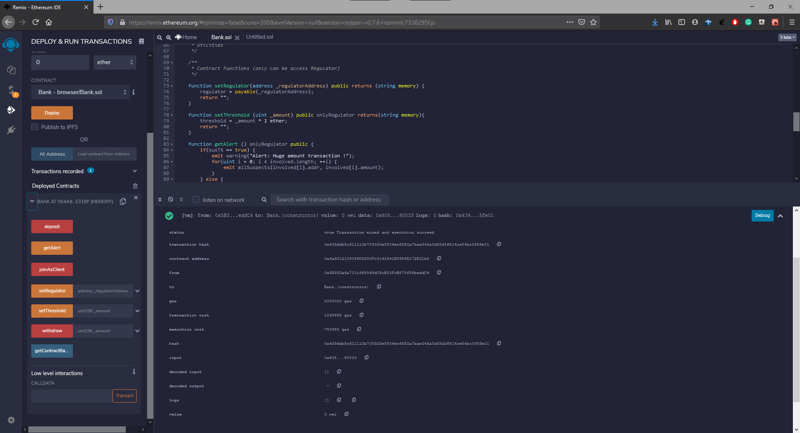
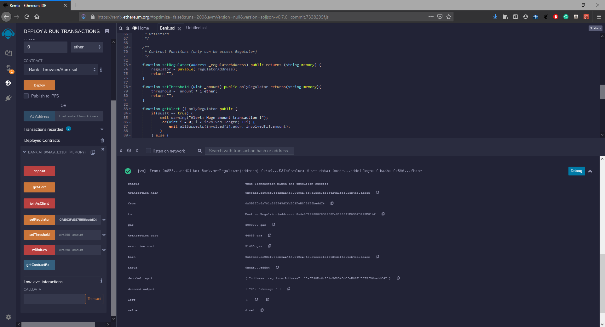
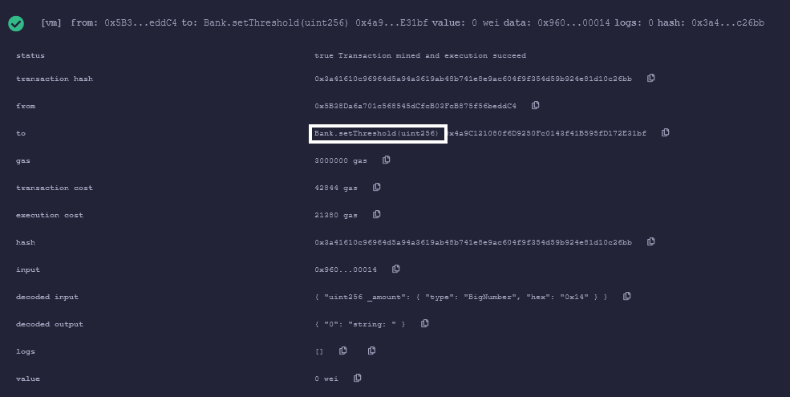
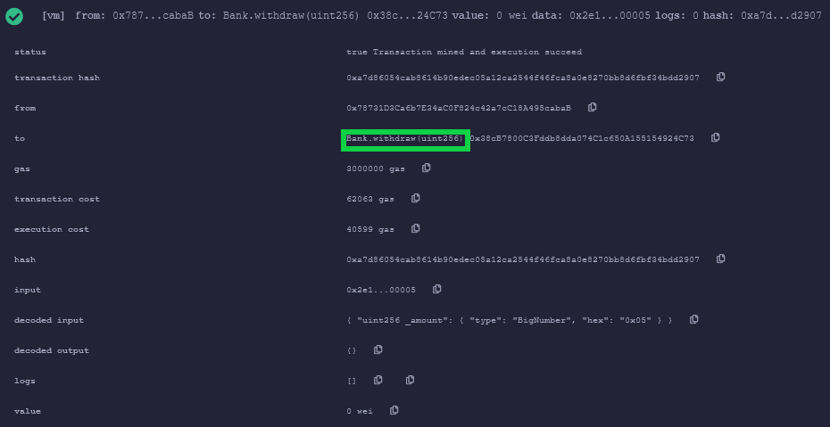
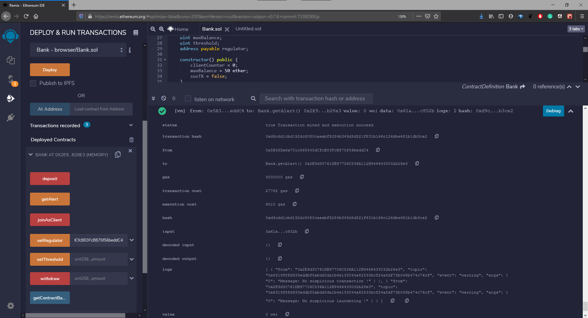
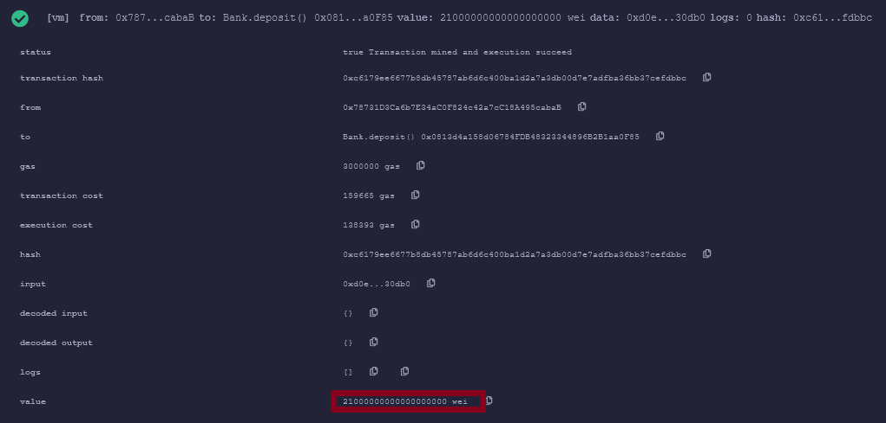
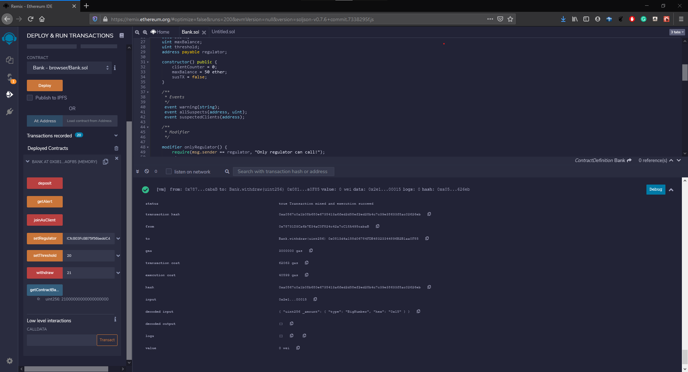
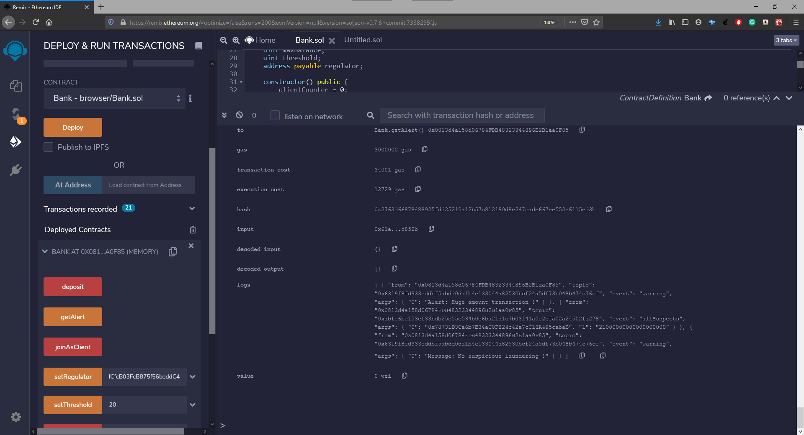
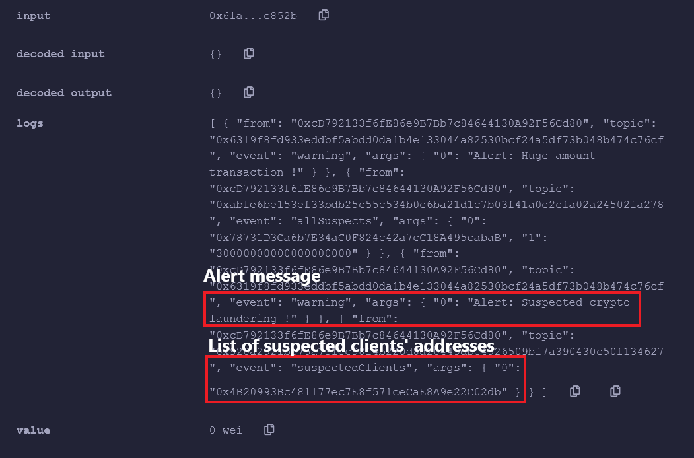
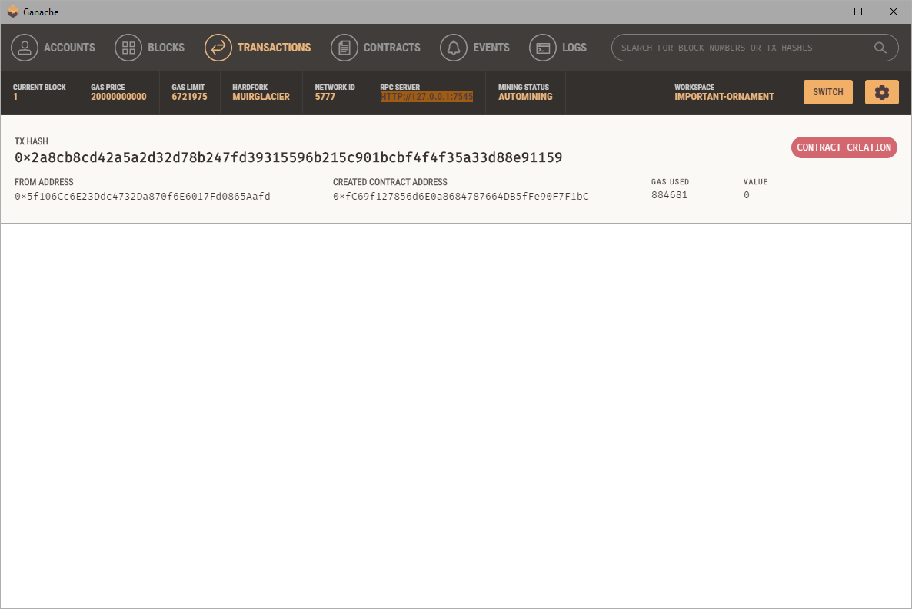

[![Forks][forks-shield]][forks-url]
[![Stargazers][stars-shield]][stars-url]
[![Issues][issues-shield]][issues-url]
[![MIT License][license-shield]][license-url]

<!-- ABOUT THE PROJECT -->
## About The Project
A smart contract which assumes the basic role of a cryptocurrency regulator (eg Bank Negara/Central Bank/Securities Commission). A regulator must be able to detect suspicious transactions and the suspects involved, as well as report them.

### Built With

* [Solidity](https://docs.soliditylang.org/en/v0.8.0/) - an object-oriented, high-level language for implementing smart contracts. 
* [Remix IDE](https://www.mysql.com/) - a browser-based compiler and IDE that enables users to build Ethereum contracts with Solidity language and to debug transactions.
* [Truffle](https://www.trufflesuite.com/truffle) - a development environment, testing framework and asset pipeline for Ethereum.
* [Ganache](https://www.trufflesuite.com/ganache) - personal blockchain for Ethereum development.

<!-- CONTRIBUTION -->
## Contribution

| Name  |Part/Contribution   |
|:---:|:-:|
|Amiruddin   |Create setManager, joinAsClientDeposit, deposit function   |
|Danial   |Create getContractBalance, checkBalance and withdraw function   |
|Final Part|Both of us work together by combining the coding to make it work, deploy it in Ganache and completing the report. 

<!-- USAGE EXAMPLES -->
## Scenarios
1. Contract created on the blockchain by a cryptocurrency regulator

2. Set a regulator's address (eg: 0x5B38Da6a701c568545dCfcB03FcB875f56beddC4)

3. Regulator sets the transaction threshold (eg: 20 ether)

4. Normal transactions - Good-day behaviour
   * Normal transaction - Deposit 19 ether (not exceeding threshold)
   

   * Normal transaction - withdraw ether not exceeding the threshold
   

   * Alert message - nothing suspicious
   
5. Huge transaction amount
   * Deposit 21 ether (exceeding threshold value)
   

   * Withdraw exceeding threshold value
   
   
   * Alert the regulator of the suspicious transaction with the involved account address and amount transfered.
   
6. Crypto Laundering
   * Alert the regulator of potential money laundering when the ether in the contract exceeded the maximum balance (50 ether). List account involved in the transaction
    

<!-- USAGE EXAMPLES -->
## Deployment on ganache
- Contract creation on ganache local blockchain
 

<!-- LICENSE -->
## License

Distributed under the MIT License. See `LICENSE` for more information.

<!-- CONTACT -->
## Contact

- Muhammad Amiruddin - 1711905 - m.amiruddin27@gmail.com
- Muhammad Danial Hakim - 1717867 - danialhakimzulkiffli@gmail.com

<!-- MARKDOWN LINKS & IMAGES -->
<!-- https://www.markdownguide.org/basic-syntax/#reference-style-links -->
[contributors-shield]: https://img.shields.io/github/contributors/amrnumenor/Regulation-Smart-Contract.svg?style=for-the-badge
[contributors-url]: https://github.com/amrnumenor/Regulation-Smart-Contract/graphs/contributors
[forks-shield]: https://img.shields.io/github/forks/amrnumenor/Regulation-Smart-Contract.svg?style=for-the-badge
[forks-url]: https://github.com/amrnumenor/Regulation-Smart-Contract/network/members
[stars-shield]: https://img.shields.io/github/stars/amrnumenor/Regulation-Smart-Contract.svg?style=for-the-badge
[stars-url]: https://github.com/amrnumenor/Regulation-Smart-Contract/stargazers
[issues-shield]: https://img.shields.io/github/issues/amrnumenor/Regulation-Smart-Contract.svg?style=for-the-badge
[issues-url]: https://github.com/amrnumenor/Regulation-Smart-Contract/issues
[license-shield]: https://img.shields.io/github/license/amrnumenor/Regulation-Smart-Contract.svg?style=for-the-badge
[license-url]: https://github.com/amrnumenor/Regulation-Smart-Contract/blob/master/LICENSE.txt
[linkedin-shield]: https://img.shields.io/badge/-LinkedIn-black.svg?style=for-the-badge&logo=linkedin&colorB=555
[linkedin-url]: https://www.linkedin.com/in/muhammad-amiruddin-bustaman-94927a1a7/
 
